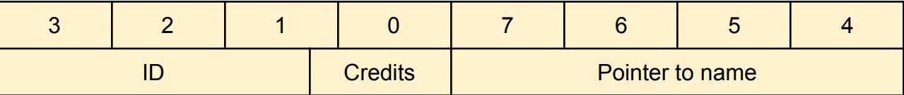

# Student Records
This file contains a set of functions written in MIPS Assembly to initialize and manage a hash table of student record structs. 

> [!IMPORTANT]
> `functions.asm` does not do anything on its own, as this file is intended for use within a larger project.

## 8 Byte Record Structure
Numbers indicate the byte number

- Student ID: 22 bits
- Number of Credits: 10 bits
- Pointer to Student Name: 32 bits

## Functions

### `init_student`

Register | Value |
--- | ---
$a0 | ID
$a1 | Credits
$a2 | Name
$a3 | Pointer to record

Stores ID, credits, and name in the record as specified in the [Record Structure](#8-byte-record-structure)

---

### `print_student`

Register | Value |
--- | ---
$a0 | Pointer to record

Prints on a single line (Note: no newline at the end):
```
<ID> <Credits> <Name>
```

---

### `init_student_array`

Register | Value |
--- | ---
$a0 | Number of students
$a1 | Array of IDs
$a2 | Array of credits
$a3 | Pointer to string of names (separated by null terminators)

Takes the given information and stores `(8 * Number of Students)` bytes of records on the top of the stack (`$sp`).

---

### `insert`

Register | Value |
--- | ---
$a0 | Record
$a1 | Pointer to table
$a2 | Size of table
$v0 | Index of record in table (set by `insert`)

> [!NOTE]
> If the hash table is full and the record pointer could not be inserted, `$v0` is set to `-1`.

With the given record, stores a pointer to it in the hash table.

---

### `search`

Register | Value |
--- | ---
$a0 | Student ID
$a1 | Pointer to table
$a2 | Size of table
$v0 | Pointer to student record if found (set by `search`)
$v1 | Index in hash table of student record if found (set by `search`)

> [!NOTE]
> If a matching record is not found, `$v0` is set to `0` and `$v1` is set to `-1`.

With the given student ID, searches for the student record in the hash table.

---

### `delete`

Register | Value |
--- | ---
$a0 | Student ID
$a1 | Pointer to table
$a2 | Size of table
$v0 | Index of deleted record in table (set by `delete`)

> [!NOTE]
> If the desired record was not found in the table, `$v0` is set to `-1`.

With the given student ID, searches for the corresponding student record and "deletes" it from the table by setting its value to `-1`.